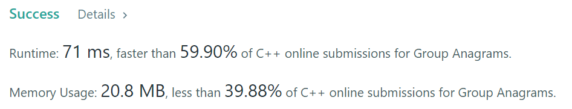

# 49. Group Anagrams

* Medium
*   Given an array of strings `strs`, group **the anagrams** together. You can return the answer in **any order**.

    An **Anagram** is a word or phrase formed by rearranging the letters of a different word or phrase, typically using all the original letters exactly once.
* [https://leetcode.com/problems/group-anagrams/](https://leetcode.com/problems/group-anagrams/)

### Solution - Map & sort

<figure><figcaption></figcaption></figure>

```
class Solution {
public:
    vector<vector<string>> groupAnagrams(vector<string>& strs) {
        unordered_map<string, vector<string>> mp;
        for (string s : strs) {
            string t = s; 
            sort(t.begin(), t.end());
            mp[t].push_back(s);
        }
        vector<vector<string>> anagrams;
        for (auto p : mp) { 
            anagrams.push_back(p.second);
        }
        return anagrams;
    }
};
```
